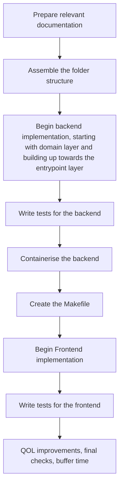

## Timeline chart

The timeline chart showcases a single sprint in which this coding excerisse will be implemented. Due to the small size of the task, no more than one week should be spent from start to finish. The timeline can be seen as a high level descripiron of what work needs to be completed in what order. Detail will be kept brief asimplementation plans have been discussed in the relevant ADR's. The points in the timeline could be broken down into several smaller tickets which will complete the timeline event when finished. 

